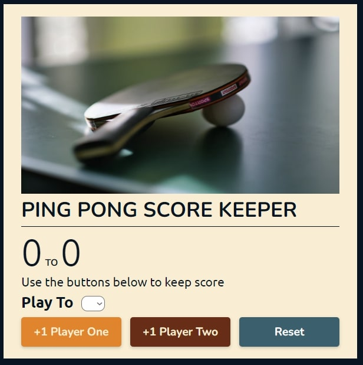
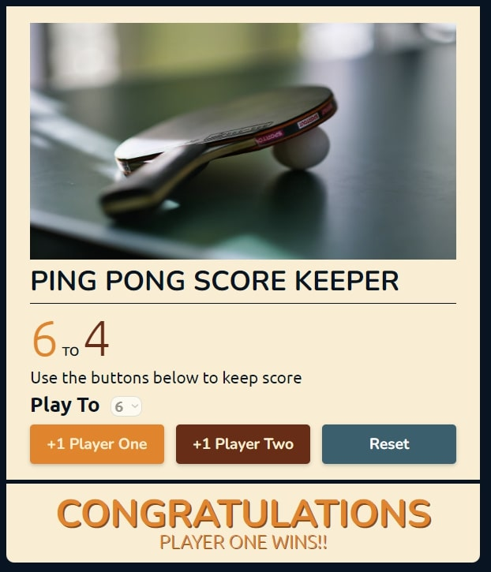

# PING PONG PROJECT - Colt Steele Udemy Course

## Table of contents

-   [Overview](#overview)
    -   [Screenshot](#screenshot)
-   [My process](#my-process)
    -   [Built with](#built-with)
-   [Author](#author)

## Overview

My version of Colt's Steele Ping Pong Project. Final project on DOM Manipulation. Cohesively merging all topics learned on (HTML, CSS and Javascript).

### Screenshot

## My process

### Built with

-   Semantic HTML5 markup
-   CSS custom properties
-   Flexbox
-   Vanilla JS

## Author

-   Tonny Mwambingu - [@Mwambingu](https://github.com/Mwambingu)
