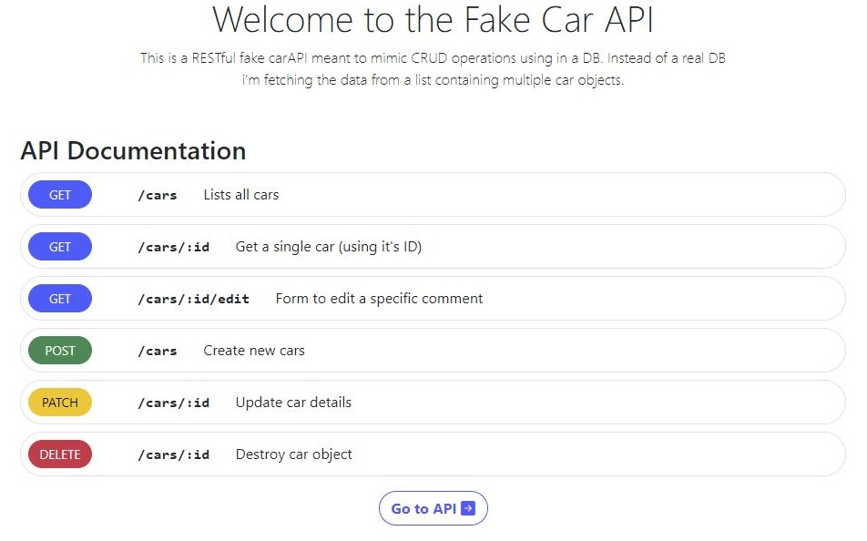
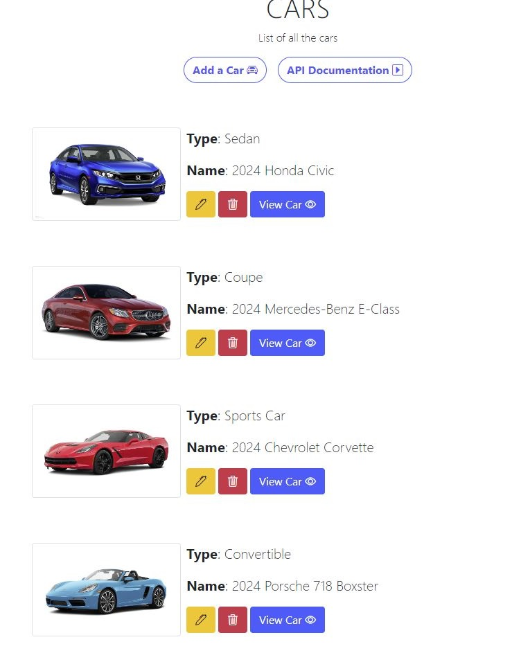
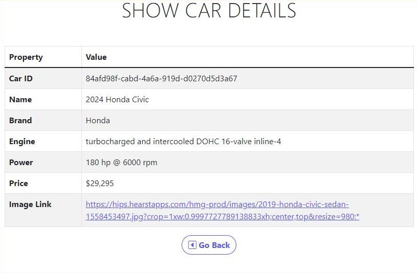
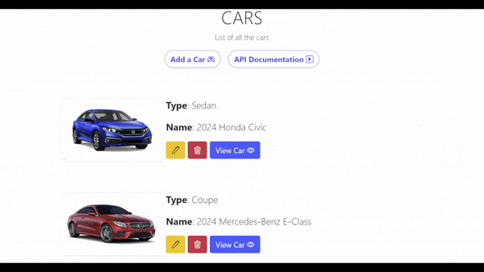

# My Own implementation of Colt's RESTful API Project using Express

## Table of contents

-   [Overview](#overview)
    -   [Screenshot](#screenshot)
-   [My process](#my-process)
    -   [Built with](#built-with)
-   [Author](#author)

## Overview

Created a fake car API using REST. The focus for this task I was focusing specifically on using Node, Express, EJS and Bootstrap. To create a fully functional API or mockup of an API. I used fake car data by storing the objects in an Array. REST made it easier to create all routes to facilitate all CRUD elements of the API. Learned a lot on handling routing using Express and templating via EJS. It was a real challenge but helped me solidify some of the learnt concepts.

### Screenshot of the App

### API Documentation - Homepage of the App

### CARS Page - Lists all vehicles in the fake db

### SHOW Page - Shows the details of the selected car

### Updating and Deleting cars

### Adding a new car to the Fake db

## My process

### Built with

-   Semantic HTML5 markup
-   CSS custom properties
-   Bootstrap
-   NodeJS
-   Express
-   EJS
-   REST

## Author

-   Tonny Mwambingu - [@Mwambingu](https://github.com/Mwambingu)
