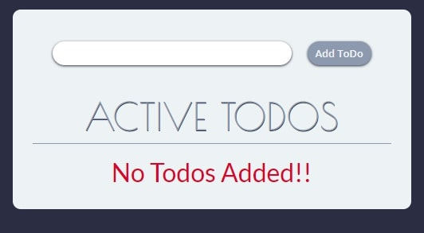
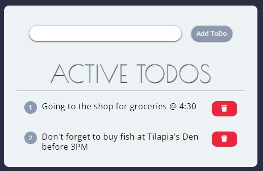
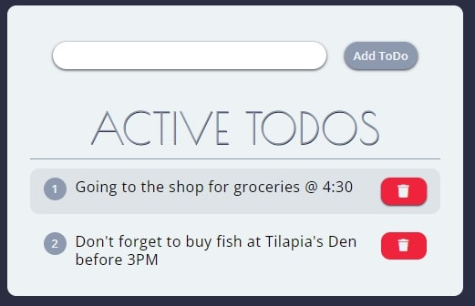
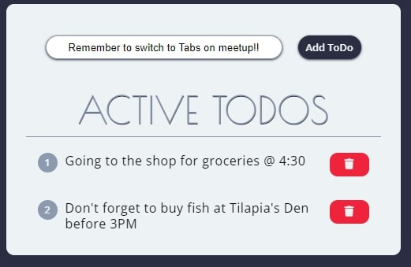

# TODO APP with Vanilla JS, CSS and HTML5

## Table of contents

-   [Overview](#overview)
    -   [Screenshot](#screenshot)
-   [My process](#my-process)
    -   [Built with](#built-with)
-   [Author](#author)

## Overview

Created a Todo app to test myself on what I had managed to learn on Colt's Steele JS basics course. Before moving to Async JS and APIs in the course. Used all the new JS topics learnt: event handling and forms with preventdefault. Merging all that together with CSS and HTML.

### Screenshot of the App

## My process

### Built with

-   Semantic HTML5 markup
-   CSS custom properties
-   Flexbox
-   Vanilla JS

## Author

-   Tonny Mwambingu - [@Mwambingu](https://github.com/Mwambingu)
